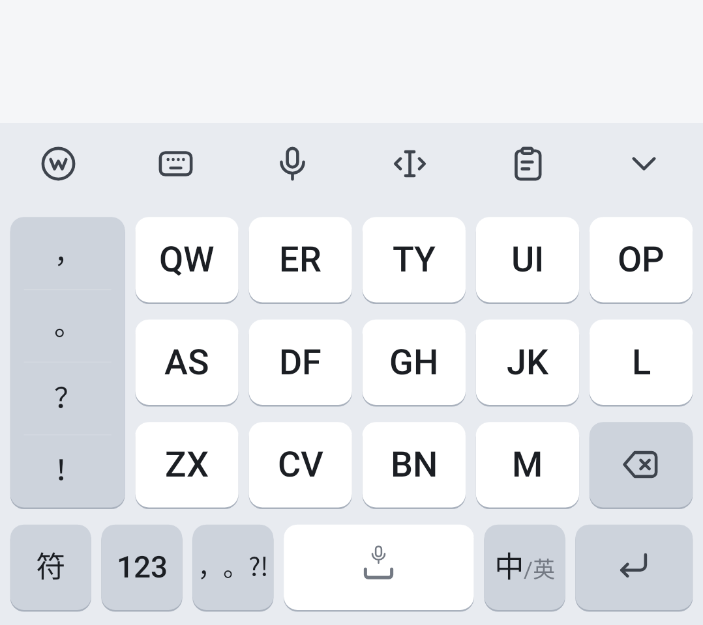
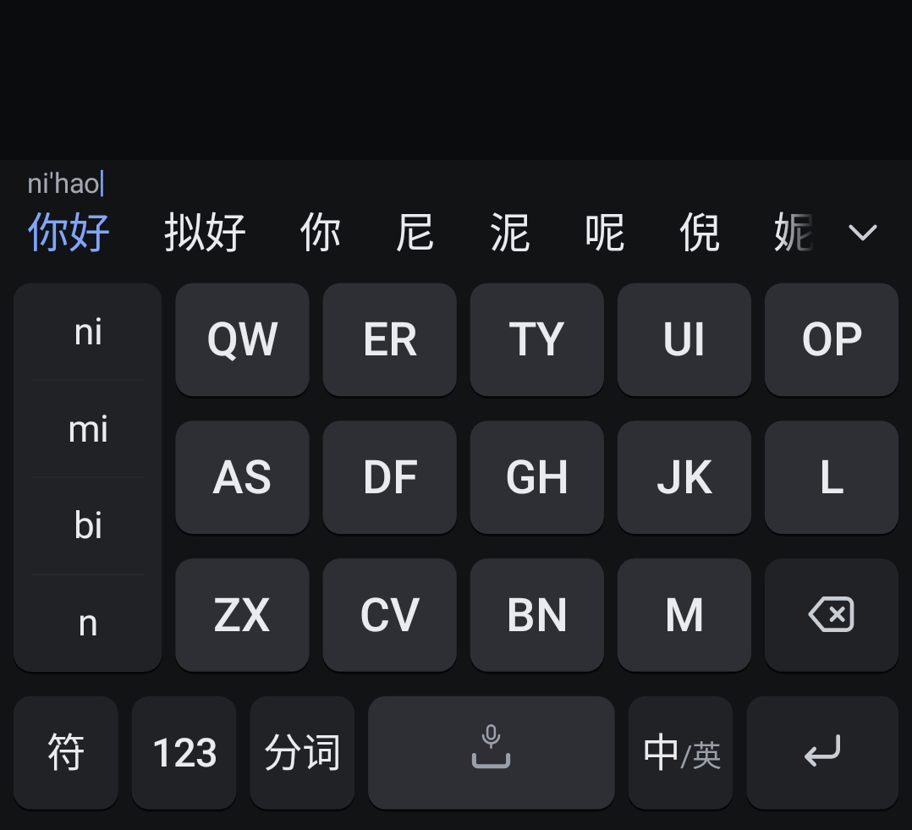
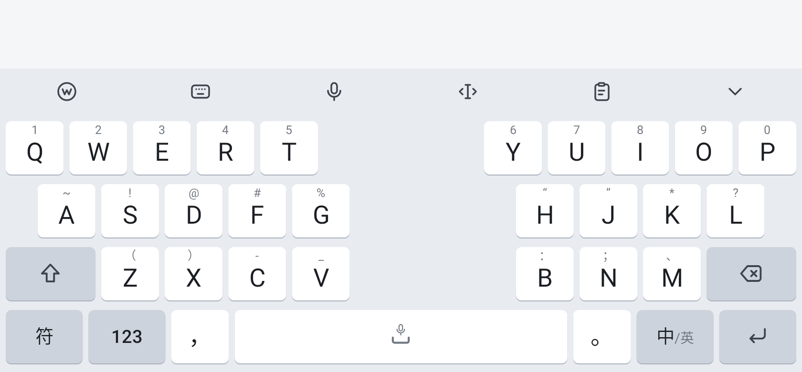
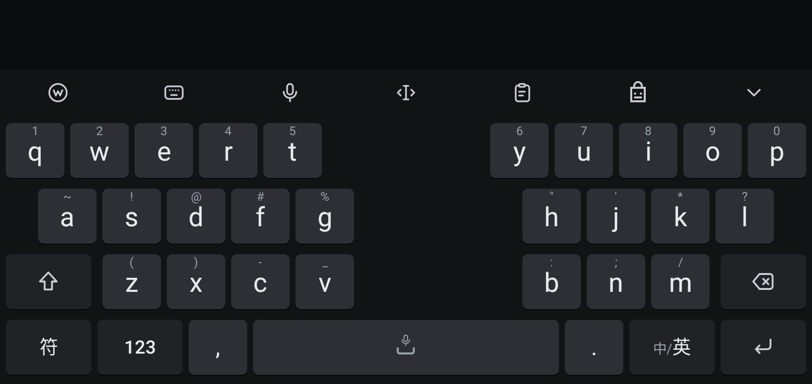
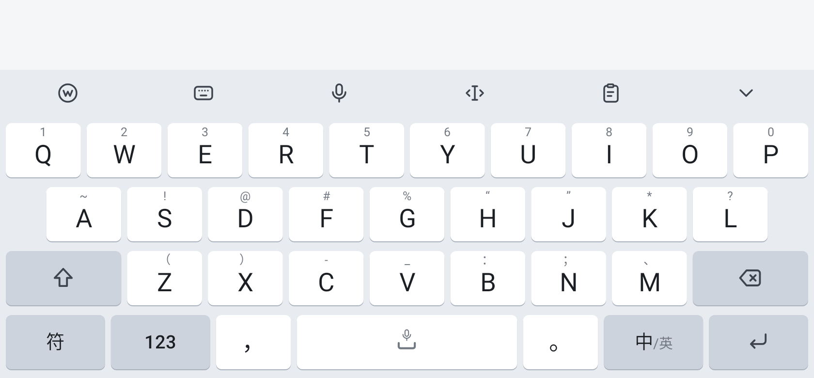
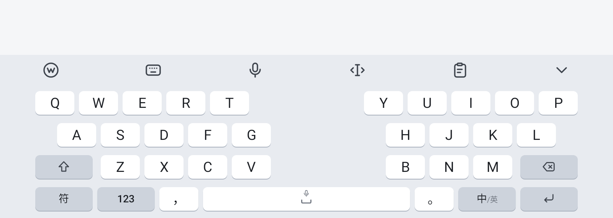
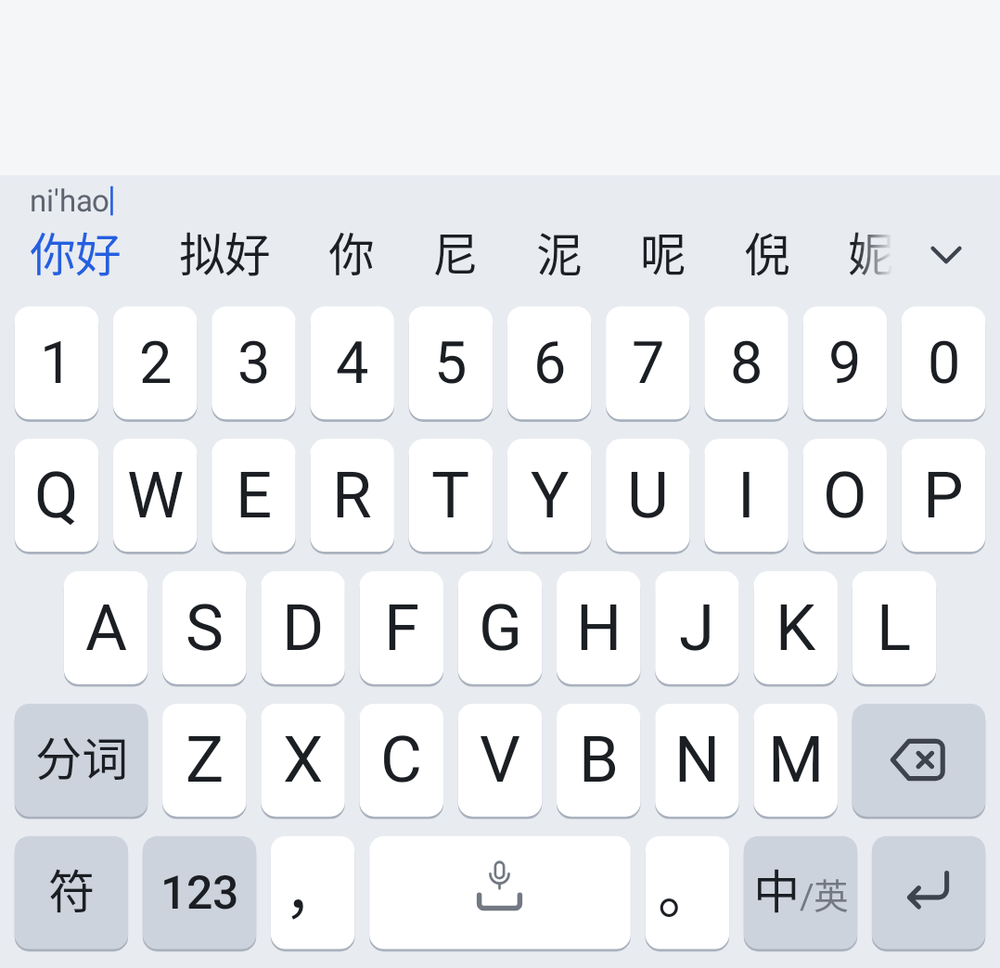

# 02 · 键盘布局与面板 / Keyboard Layouts & Panels

> 尺寸、颜色 token 见 `01-design-system.md`；绘制细节见 `04-components-spec.md`。
> Tokens in `01`, drawing details in `04`.

**记号 / Notation**

- `w=1.5` 表示宽度权重，每行权重之和 = 10（26 键）。格子宽 = `(键盘宽 − 2×kbPadH) × w / 10`，按键视觉矩形 = 格子四边各内缩 3dp/5dp。
  *`w` = width weight; each row sums to 10 on QWERTY.*
- `[主标签 | ↑副标签 | ⋯长按]`：主标签 / 上滑或长按单项副字符 / 长按弹出列表。
  *`[main | ↑swipe-up | ⋯long-press list]`.*
- `F` = 功能键（`kb.keyFunc`），`A` = 强调色键（`kb.keyAccent`），其余为字符键（`kb.key`）。

---

## 1. 键盘窗口结构 / Window structure

```
┌──────────────────────────────────────────────┐ ─┐
│  顶栏 Top bar  48dp  (工具栏 ⇄ 候选栏)          │  │
├──────────────────────────────────────────────┤  │ kbPadTop 2dp
│                                              │  │
│  主区域 Main area  4 × rowPitch (224dp 标准)   │  │  键盘/面板在此区域切换
│  键盘 / 光标 / 剪贴板 / 工具箱 / 符号 / 语音     │  │  all panels swap here
│  / 候选展开                                   │  │
│                                              │  │
├──────────────────────────────────────────────┤  │ kbPadBottom 4dp
│  导航栏 inset（手势条区域，背景同 kb.background） │  │
└──────────────────────────────────────────────┘ ─┘
```
- 面板切换时顶栏保持可见（语音面板、候选展开除外，它们会接管顶栏，见 §12、§2.3）。
  *The top bar stays visible across panels, except voice and expanded candidates which take it over.*
- 返回主键盘统一方式：再次点击顶栏中已高亮的图标，或面板内「返回」键。系统返回键：先关闭面板，再收起键盘。
  *Back to keyboard: tap the highlighted top-bar icon again, or the panel's Back key. System Back closes panel first, then hides keyboard.*

---

## 2. 顶栏 / Top bar（48dp）

### 2.1 空闲态：工具栏 / Idle: toolbar

6 个图标等分宽度（每格 = 宽/6），图标 24dp 居中，按下/当前面板时显示 `kb.toolbarActive` 圆角底块 40×36dp（r=10dp）。
*6 icons, equal cells, 24dp glyph; active/pressed pill 40×36dp r10.*

| 序 | 图标 Icon | 名称 | 点击 Tap | 长按 Long-press |
|---|---|---|---|---|
| 1 | `ic_logo` 织文标 | 工具箱 Toolbox | 打开工具箱面板（§11） | 打开设置 App |
| 2 | `ic_keyboard` | 键盘切换 Layouts | 打开「键盘选择」浮层（§2.4） | — |
| 3 | `ic_mic` | 语音 Voice | 打开语音面板（§12） | 直接进入「按住说话」，松手结束 |
| 4 | `ic_cursor` | 光标编辑 Cursor | 打开光标编辑面板（§9） | — |
| 5 | `ic_clipboard` | 剪贴板 Clipboard | 打开剪贴板面板（§10） | — |
| 6 | `ic_chevron_down` | 收起 Hide | `requestHideSelf(0)` | — |

- 与主流输入法的差异：第 5 项用「剪贴板」图标代替剪刀，语义更准确。*We use a clipboard glyph instead of scissors.*
- 剪贴板有新内容（30 秒内复制、且不来自密码框）时，顶栏第 1 格临时替换为**剪贴板建议 chip**：`[📋 复制的文字前 12 字…]`，点击直接上屏，10 秒或输入后消失。
  *Recent-copy suggestion chip temporarily occupies the toolbar for 10s.*

```
┌────────┬────────┬────────┬────────┬────────┬────────┐
│   ◎    │   ⌨    │   🎙   │  ‹I›   │   📋   │   ⌄    │  48dp
└────────┴────────┴────────┴────────┴────────┴────────┘
```

### 2.2 输入中：候选栏 / Composing: candidate bar

两行结构，**总高仍为 48dp**（不跳动）。*Two-line layout inside the same 48dp.*

```
 x=12dp
 ┌────────────────────────────────────────────────────────┬──────┐
 │ ni'hao|                                   (12.5dp, y=4–18)     │
 │ 你好   拟好   你   尼   泥   呢   倪   妮  ›››渐隐          │  ⌄   │
 │ ^首选 kb.candidateFirst 500                 (19dp, y=18–48)│ 44dp │
 └────────────────────────────────────────────────────────┴──────┘
```

| 元素 Element | 规格 Spec |
|---|---|
| 组合串 Composing | 左上角 x=12dp，基线 y=15dp，`type.composing`，`kb.labelSecondary`；显示切分后的拼音（`ni'hao`），末尾 1dp 宽 12dp 高光标 `kb.candidateFirst`，光标可点击组合串左右移动（点击组合串进入“编辑拼音”：左右键在候选栏出现）|
| 候选行 Candidate row | y=18–48dp（30dp 高），横向滚动 `RecyclerView`/自绘 `HorizontalScroll`；每项左右 padding 12dp、最小宽 40dp（文字左对齐）；第 1 项 `kb.candidateFirst` + 500 字重；其余 `kb.label` |
| 分隔 Separator | 候选之间**无**竖线；靠 24dp 间距区分 / no dividers |
| 展开箭头 Expand | 右侧固定 44dp 宽，`ic_chevron_down` 22dp，左侧 16dp 渐隐遮罩（背景色 0→100%）盖住滚动内容；无更多候选时隐藏 |
| 英文联想 | 英文模式下组合串行隐藏，候选行垂直居中（y 占满 48dp），首项为原样输入 |
| 按下态 | 候选项按下显示 `kb.toolbarActive` 圆角 8dp 底块（高 30dp） |
| 长按候选 | 若为用户词/学习词 → 弹出小气泡「删除该词」；系统词无操作 |

- 候选滚动到末尾自动向内核请求下一页（每页 30 条）。*Auto-load next page at scroll end.*
- 组合串过长（> 候选栏宽 60%）时左侧省略：`…hao'ma'shi`。*Ellipsize from the left.*

### 2.3 候选展开面板 / Expanded candidate grid

点击 ⌄ 后，**顶栏 + 主区域**合并为候选网格（总高不变）。*Takes over top bar + main area.*

```
┌───────────────────────────────────────────────┬────────┐
│ ni'hao                                          │   ⌃    │ 48dp 顶行：组合串 + 收起
├────────────┬────────────┬───────────┬─────────┼────────┤
│   你好     │   拟好      │    你     │   尼     │   ⌫    │
├────────────┼────────────┼───────────┼─────────┤        │
│   泥       │   呢        │  倪       │  妮      ├────────┤
├────────────┴──┬─────────┴──┬────────┴─────────┤  重输   │
│  你好吗        │  你好啊     │   逆             │        │
├───────────────┼────────────┼──────────────────┼────────┤
│   …（纵向滚动 / vertical scroll）                │  返回   │
└───────────────────────────────────────────────┴────────┘
```

| 项 | 规格 |
|---|---|
| 网格 Grid | 左侧宽 = 总宽 − 64dp；行高 52dp；每行按「最小单元 = 网格宽/4」流式排布：词宽 ≤ 1 单元占 1 格，否则占 2/3/4 格，行尾剩余空间均分给该行各项 |
| 分割线 Dividers | 0.5dp `kb.divider`，横线贯穿、竖线仅在同一行内 |
| 右侧操作列 Side column | 64dp 宽，3 个 `F` 键：⌫（删除组合串一个字母）、重输（清空组合串）、返回（收起网格），各占 1/3 高 |
| 九键附加 T9 extra | 九键时右列第 1 项改为「拼音」：点击在网格顶部插入一行拼音选择 chip（ni / mi / oh …） |
| 选择 Select | 点击候选 → 上屏并收起；若组合串未消耗完，网格保持并刷新 |

### 2.4 键盘选择浮层 / Layout picker

从工具栏第 2 格点开，覆盖主区域（非全屏弹窗）。*Overlays the main area.*

```
┌─────────────────────────────────────────────────┐
│  选择键盘                                    完成 │ 44dp
│  ┌─────────┐ ┌─────────┐ ┌─────────┐ ┌─────────┐ │
│  │ ▦ 26键  │ │ ▦ 九键  │ │ ▦ 双拼  │ │ ▦ 五笔  │ │ 卡片 76×72dp
│  │  全拼 ✓ │ │  拼音   │ │ 小鹤    │ │  86     │ │ 选中：accentSoft 底 + accent 描边 1.5dp
│  └─────────┘ └─────────┘ └─────────┘ └─────────┘ │
│  ┌─────────┐                                      │
│  │ ▦ 英文  │    （方案细节在设置 App 里调整）      │
│  └─────────┘                                      │
└─────────────────────────────────────────────────┘
```
- 仅显示在设置中「已启用」的方案；只启用一个方案时，此按钮改为切换“中/英”并隐藏浮层。
  *Only enabled schemes are shown.*

---

## 3. 26 键拼音（全拼）/ QWERTY Pinyin

```
行1 │ Q  │ W  │ E  │ R  │ T  │ Y  │ U  │ I  │ O  │ P  │   w=1 ×10
    │ 1  │ 2  │ 3  │ 4  │ 5  │ 6  │ 7  │ 8  │ 9  │ 0  │   ↑ 上滑副标签
行2 │·│ A  │ S  │ D  │ F  │ G  │ H  │ J  │ K  │ L  │·│   左右各留 0.5 空白
    │ │ ~  │ !  │ @  │ #  │ %  │ “  │ ”  │ *  │ ?  │ │
行3 │  分词/⇧  │ Z  │ X  │ C  │ V  │ B  │ N  │ M  │   ⌫    │ 1.5 + 7×1 + 1.5
    │          │ （ │ ） │ -  │ _  │ ：  │ ；  │ 、 │        │
行4 │ 符  │ 123 │ ，  │      空格 🎙      │ 。  │ 中/英 │ ⏎   │
    │ 1.3 │ 1.3 │ 1   │       2.8         │ 1   │ 1.3  │ 1.3 │
```

| 键 Key | 类型 | 主标签 Main | 上滑 ↑ | 长按 ⋯ | 功能 Function |
|---|---|---|---|---|---|
| Q…P | 字符 | 大写字母 | 1…0 | `1 ¹ ₁ ①`（数字变体） | 输入字母进入组合 |
| A…L | 字符 | 大写字母 | ~ ! @ # % “ ” * ? | 该符号 + 字母本身小写 | 同上 |
| Z…M | 字符 | 大写字母 | （ ） - _ ： ； 、 | 同上 | 同上 |
| 分词/⇧ | F, w1.5 | 空闲：`ic_shift`；输入中：「分词」 | — | — | 空闲：下一个字母以英文大写直接上屏；输入中：插入分隔符 `'` |
| ⌫ | F, w1.5 | `ic_backspace` | — | — | 见 §14 删除手势 |
| 符 | F | 符 | — | — | 打开符号面板（§8） |
| 123 | F | 123 | — | — | 打开数字键盘（§7） |
| ， | 字符 | ， | ↑ 「，」→「,」切半角 | `， 、 ； ： ,` | 输入中：先上屏首选再输出 |
| 空格 | 字符 w2.8 | 中央 `ic_space` 24dp + 上方 `ic_mic` 12dp（均为 `kb.labelHint`）| — | 长按 500ms 不动 → 按住说话 | 输入中：上屏首选；空闲：空格；左右拖动 → 移动光标（§14）|
| 。 | 字符 | 。 | ↑ `.` | `。 ？ ！ … ·` | 同「，」 |
| 中/英 | F | **中**/英（当前语言 16dp 500，另一半 12dp `kb.labelHint`，中间 `/`） | — | 弹出方案小气泡：全拼/九键/双拼/五笔/英文 | 切换中英 |
| ⏎ | F 或 A | 见下表 | — | — | 输入中：**上屏原始字母**（不上屏汉字）；空闲：执行 editorAction |

**回车键状态（自动，无设置项）/ Enter key states (automatic)**

| `imeOptions` | 标签 | 颜色 |
|---|---|---|
| 无 / `actionNone` / 多行 | `ic_enter` | F |
| `actionSend` | 发送 | A |
| `actionSearch` | `ic_search` | A |
| `actionGo` | 前往 | A |
| `actionNext` | 下一项 | F |
| `actionDone` | 完成 | A |
| 输入中 composing | `ic_enter` | F（忽略 action，避免误发送 / never sends mid-composition） |

---

## 4. 26 键英文 / QWERTY English

与 §3 行 1–3 相同键位，区别：*Same grid as §3, differences:*

- 字母主标签随 shift 状态显示**大/小写**（小写态 `type.keyLetterLower`）。*Labels follow case.*
- 行 2 上滑副标签改为半角：`~ ! @ # % " ' * ?`；行 3：`( ) - _ : ; /`。
- 行 3 左键固定为 shift，三态：

| 状态 State | 图标 | 背景 | 进入方式 |
|---|---|---|---|
| 关 Off | `ic_shift`（描边） | F | 默认；输入 1 个字母后从 Once 回到 Off |
| 单次 Once | `ic_shift_filled`（实心） | F | 单击；或句首自动大写（`TYPE_TEXT_FLAG_CAP_SENTENCES`） |
| 锁定 Lock | `ic_shift_lock`（实心 + 下划线） | `kb.accentSoft`，图标 `kb.keyAccent` | 300ms 内双击；再次单击回到 Off |

- 行 4：`符 | 123 | , | 空格 | . | 中/英 | ⏎`，`,` 长按 `, ; : '`，`.` 长按 `. ? ! … @ /`。
- 双击空格 → `. `（句号 + 空格），仅英文模式。*Double-space → ". " in English only.*
- 英文模式的候选栏显示单词补全/纠错（本地词表），首项为原样输入。

---

## 5. 双拼 / Shuangpin（在 26 键上）

键位与 §3 完全相同；**可选**显示韵母提示（设置 → 输入方案 → 双拼 →「显示按键提示」，默认开）。
*Same grid as §3; optional final hints.*

**提示样式 / Hint style**：副标签从「上方居中」改为**右下角**（x = 右内边距 4dp，基线 = 底部 5dp），`type.keyHintCjk` 9.5dp，`kb.labelHint`；上滑数字提示仍在上方居中，但改为 9dp。提示开启时主标签缩为 **20dp**，垂直中心上移到 `keyH × 0.47`，给右下提示让位。两个韵母用 `/` 分隔，超过 5 个字符时只显示第一个。
*Final hints bottom-right 9.5dp; numeric hint top-centre 9dp; with hints on, the letter shrinks to 20dp and centres at keyH × 0.47.*

```
┌──────────┐
│    1     │ ← 数字提示 9dp
│    Q     │ ← 主标签 22dp
│       iu │ ← 韵母提示 9.5dp，右下
└──────────┘
```

小鹤双拼默认提示表 / Xiaohe default:

| 键 | Q | W | E | R | T | Y | U | I | O | P |
|---|---|---|---|---|---|---|---|---|---|---|
| 提示 | iu | ei | e | uan | ue | un | sh/u | ch/i | uo | ie |

| 键 | A | S | D | F | G | H | J | K | L |
|---|---|---|---|---|---|---|---|---|---|
| 提示 | a | ong | ai | en | eng | ang | an | ing | iang |

| 键 | Z | X | C | V | B | N | M |
|---|---|---|---|---|---|---|---|
| 提示 | ou | ua | ao | zh/ui | in | iao | ian |

- 每个方案（小鹤、自然码、微软、搜狗、智能ABC、拼音加加）的提示表由内核方案文件提供，UI 只负责渲染字符串。
  *Hint tables come from the engine's scheme files; UI only renders strings.*
- 组合串显示**全拼展开**（输入 `nihk` 显示 `ni'hao`），降低记忆负担。*Composing shows expanded full pinyin.*
- 分词键在双拼下隐藏为 ⇧（双拼每 2 键一音节，无需分词）。

---

## 6. 五笔 86 / Wubi 86

键位与 §3 相同。**可选**字根提示（设置 → 输入方案 → 五笔 →「显示字根提示」，默认关）。
*Same grid; optional root hints (default off).*

- 提示位置同双拼（右下角），内容为**键名字**（一个汉字）：*Hint = key-name radical:*

| 区 | 键 → 键名 |
|---|---|
| 横区 1 | G 王 · F 土 · D 大 · S 木 · A 工 |
| 竖区 2 | H 目 · J 日 · K 口 · L 田 · M 山 |
| 撇区 3 | T 禾 · R 白 · E 月 · W 人 · Q 金 |
| 捺区 4 | Y 言 · U 立 · I 水 · O 火 · P 之 |
| 折区 5 | N 已 · B 子 · V 女 · C 又 · X 纟 |
| 特殊 | Z → 「？」万能学习键（提示色 `kb.candidateFirst`） |

- **长按**字母键 → 气泡展示该键完整字根口诀（如 G：「王旁青头戋五一」），仅展示不输入，松手关闭。
  *Long-press shows the full root rhyme (display only).*
- 候选项右侧附带 10dp 灰色编码提示（`kb.labelHint`），例如 `工 a`、`式 aa`；四码唯一时自动上屏（内核决定）。
- 行 3 左键为 ⇧（临时英文），无分词键。

---

## 7. 数字键盘 / Number pad

列权重：`1 | 1.3 | 1.3 | 1.3 | 1.1`（合计 6.0，按比例铺满）；键高沿用 rowPitch。圆角 `radius.keyLarge`。
*Column weights 1 | 1.3 | 1.3 | 1.3 | 1.1.*

```
┌──────┬────────┬────────┬────────┬──────┐
│  +   │   1    │   2    │   3    │  ⌫   │
│  -   ├────────┼────────┼────────┼──────┤
│  *   │   4    │   5    │   6    │ 空格 │
│  /   ├────────┼────────┼────────┼──────┤
│  %   │   7    │   8    │   9    │      │
│  =  ↕│        │        │        │  ⏎   │
├──────┼────────┼────────┼────────┤ (跨2行)│
│ 返回 │   符   │   0    │   .    │      │
└──────┴────────┴────────┴────────┴──────┘
```

| 键 | 说明 |
|---|---|
| 左列（跨行 1–3） | 可纵向滚动的符号列表：`+ - * / % = . , : @ ( ) #`，每项高 = 3×rowPitch/5，背景 F，项间 0.5dp 分割线 |
| 1–9, 0 | 字符键，`type.numpad` 等宽数字；上滑无；长按 `0` → `°`，`.` 长按 → `,` `:` |
| ⌫ | 同 §14 删除规则 |
| 空格 | 输出半角空格 |
| ⏎ | 跨行 3–4，状态同 §3 回车表 |
| 返回 | 回到进入前的键盘 |
| 符 | 打开符号面板 |

- 当输入框 `inputType = number/phone` 时直接显示本键盘，且「返回」键隐藏（替换为 `,` / 电话模式下为 `+`）。
  *For number/phone fields show this pad directly; Back is hidden.*

---

## 8. 符号面板 / Symbol panel

```
┌───────────────────────────────────────────────┐
│ ，   。   ？   ！   、   ：   ；               │  网格区：6 列（表情 8 列），
│ “    ”   ‘    ’   （   ）  《                │  格高 = rowPitch − 4dp，纵向滚动
│ 》   【   】   …   —   ·   ～                │  字符 20dp，按下 kb.toolbarActive 底
│ ￥   ＠   ＃   ％   ＆   ＊   ＋              │
├──────┬────────────────────────────────┬───────┤
│ 返回 │ 常用 中文 英文 数学 序号 箭头 表情 颜文 │  🔓 ⌫  │ 底行 = rowPitch
└──────┴────────────────────────────────┴───────┘
```

| 项 | 规格 |
|---|---|
| 分类 Tabs | 底行中部横向滚动：**常用**（最近使用 24 个 + 默认）、**中文**、**英文**、**数学**、**序号**（①⑴一壹…）、**箭头**、**表情**（Emoji，按 Unicode 分组，8 列）、**颜文字**（2 列） |
| Tab 样式 | 文字 14dp，未选 `kb.labelSecondary`；选中 `kb.label` 500 + 底部 16×3dp 圆角指示条 `kb.keyAccent` |
| 返回 | 左侧 F 键 w=1.3，回到之前键盘 |
| 锁定 🔒/🔓 | 右侧图标键：解锁（默认）= 输入一个符号后自动返回键盘；锁定 = 停留。表情/颜文字 Tab 永远停留 |
| ⌫ | 右侧 F 键 |
| 成对符号 | `“”` `（）` `《》` `【】` 点击成对输入并把光标放中间（长按只输入单个） |
| Emoji 肤色 | 长按支持肤色的 emoji → 6 格气泡选择肤色，记住选择 |

---

## 9. 光标编辑面板 / Cursor edit panel

与主流输入法一致的 5 列 × 3 行，列权重 `1 | 1.25 | 1.25 | 1.25 | 1`，每行高 = 4×rowPitch/3。
*5 cols × 3 rows, like mainstream IMEs.*

```
┌───────┬──────────┬──────────┬──────────┬───────┐
│  Tab  │   复制   │    ⌃     │   粘贴   │   ⌫   │
├───────┼──────────┼──────────┼──────────┼───────┤
│ 开头  │    ‹     │   选择   │    ›     │  Del  │
├───────┼──────────┼──────────┼──────────┼───────┤
│ 末尾  │   全选   │    ⌄     │   剪切   │ 返回  │ ← A 强调键
└───────┴──────────┴──────────┴──────────┴───────┘
   F          字符键（白）                    F
```

| 键 | 行为 |
|---|---|
| ‹ › ⌃ ⌄ | 发送 DPAD 方向键；长按以 50ms 连发；「选择」开启时附带 Shift（扩选） |
| 选择 | 切换扩选模式：开启时背景 `kb.accentSoft`、文字 `kb.keyAccent` |
| 开头 / 末尾 | `MOVE_HOME` / `MOVE_END`（Ctrl+Home/End 语义：整段开头/末尾）；选择模式下扩选 |
| 复制 / 剪切 / 粘贴 / 全选 | `performContextMenuAction(android.R.id.copy/cut/paste/selectAll)`；无选区时复制/剪切置灰 `kb.labelDisabled` |
| Tab | 输入 `\t` |
| ⌫ / Del | 向前删 / 向后删（`KEYCODE_FORWARD_DEL`） |
| 返回 | 强调色；回到键盘 |

- 中文标签使用系统字体 500 字重（**不用**某些输入法的书法字体）。*System font, not calligraphic.*

---

## 10. 剪贴板面板 / Clipboard panel

```
┌───────────────────────────────────────────────┐
│ ‹  剪贴板                         📌  ✎  🗑  │ 44dp 标题行
├───────────────────────────────────────────────┤
│ ┌───────────────────┐ ┌───────────────────┐   │ 2 列卡片网格，卡片 r12，
│ │ 📌 收货地址：上海市 │ │ https://github.com │   │ padding 10dp，文字 14dp，
│ │ 浦东新区……         │ │ /example/weave-…   │   │ 最多 3 行
│ │            已固定  │ │             2 分钟前│   │ 底部 11dp 时间 kb.labelHint
│ └───────────────────┘ └───────────────────┘   │
│ ┌───────────────────┐ ┌───────────────────┐   │
│ │ 验证码 482913      │ │ 好的，明天见        │   │
│ └───────────────────┘ └───────────────────┘   │
└───────────────────────────────────────────────┘
```

| 项 | 规格 |
|---|---|
| 标题行 | 左 `ic_chevron_left` 返回 + 「剪贴板」`type.panelTitle`；右侧 3 个 36dp 图标按钮：固定视图切换（只看已固定）、编辑（进入多选模式）、清空（二次确认，已固定项不清空） |
| 卡片点击 | 上屏全文 |
| 卡片长按 | 卡片内浮出 3 个动作：固定/取消固定、编辑后上屏、删除 |
| 多选模式 | 卡片左上出现圆形勾选框，标题行变为「已选 2 项   删除  完成」 |
| 排序 | 已固定在前，其余按时间倒序；未固定最多保存 50 条，超出淘汰最旧 |
| 隐私 | 来自密码框（`TYPE_TEXT_VARIATION_PASSWORD` 等）或带 `ClipDescription.EXTRA_IS_SENSITIVE` 的内容不记录；未固定项 24 小时后自动删除 |
| 空状态 Empty | 垂直居中：`ic_clipboard` 40dp `kb.labelDisabled` + 下方 8dp 文字「复制的内容会出现在这里」13dp `kb.labelSecondary`；**不使用插画** |

---

## 11. 工具箱面板 / Toolbox panel

点击顶栏 ◎ 打开；顶栏 ◎ 显示高亮底块，其余图标保持可用。*Opens from ◎; top bar stays.*

```
┌───────────────────────────────────────────────┐
│ ┌────────┐ ┌────────┐ ┌────────┐ ┌────────┐   │ 4 列等宽卡片，间距 8dp，
│ │   ⌨    │ │   ⤢    │ │   ☾    │ │   繁   │   │ 面板内边距 12dp，
│ │输入方案 │ │键盘调节 │ │深色模式 │ │繁体输出 │   │ 卡片高 = (主区高 − 24 − 16)/3
│ └────────┘ └────────┘ └────────┘ └────────┘   │ 图标 26dp，文字 12dp
│ ┌────────┐ ┌────────┐ ┌────────┐ ┌────────┐   │ 纵向可滚动（超过 12 项时）
│ │   ☺    │ │   ▤    │ │   ◧    │ │   〰   │   │
│ │  表情   │ │ 常用语  │ │ 单手模式 │ │ 语音引擎 │   │
│ └────────┘ └────────┘ └────────┘ └────────┘   │
│ ┌────────┐ ┌────────┐ ┌────────┐ ┌────────┐   │
│ │   ‹I›  │ │   📋   │ │   ⬡    │ │   ⧉    │   │
│ │ 光标编辑 │ │ 剪贴板  │ │  设置   │ │ 悬浮键盘 │   │
│ └────────┘ └────────┘ └────────┘ └────────┘   │
└───────────────────────────────────────────────┘
```

| # | 项 | 图标 | 类型 | 行为 |
|---|---|---|---|---|
| 1 | 输入方案 | `ic_keyboard` | 跳转 | 打开 §2.4 键盘选择 |
| 2 | 键盘调节 | `ic_resize` | 跳转 | 键盘内浮层：5 档键高分段条 + 实时预览，「完成」 |
| 3 | 深色模式 | `ic_moon` | **开关** | 在「跟随系统 → 深色 → 浅色」间循环；卡片副文字显示当前值 |
| 4 | 繁体输出 | 文字「繁」 | **开关** | 候选以繁体输出（OpenCC 规则由内核处理）|
| 5 | 表情 | `ic_emoji` | 跳转 | 符号面板定位到「表情」Tab |
| 6 | 常用语 | `ic_quick_phrase` | 跳转 | 常用语列表面板（结构同剪贴板，标题「常用语」+「添加」）|
| 7 | 单手模式 | `ic_one_hand` | **开关** | 键区宽度缩至 82%，靠左/右（再点一次切换方向，第三次关闭），空出一侧显示 `ic_chevron_left/right` 大按钮切换方向 |
| 8 | 语音引擎 | `ic_waveform` | 跳转 | 打开 §12.4 引擎切换弹层 |
| 9 | 光标编辑 | `ic_cursor` | 跳转 | §9 |
| 10 | 剪贴板 | `ic_clipboard` | 跳转 | §10 |
| 11 | 设置 | `ic_settings` | 跳转 | 启动设置 App |
| 12 | 悬浮键盘 | `ic_float` | **开关** | 键盘变为可拖动的小卡片，App 不被压缩（06 §5）。帮助入口在设置 App「关于 → 使用帮助」 |

- **开关类**卡片开启时：卡片底 `kb.accentSoft`，图标与文字 `kb.keyAccent`。*Toggle cards tint when on.*
- 卡片按下：底色 `kb.keyPressed`。**无**账号头像、会员标、推荐大卡。*No account header, badges, or promo tiles.*

---

## 12. 语音输入面板 / Voice input panel

语音面板**接管顶栏 + 主区域**。*Takes over top bar + main area.*

### 12.1 点按说话（默认）/ Tap-to-talk (default)

```
┌───────────────────────────────────────────────┐
│ ⌄                [◉ 系统语音识别 ▾]         ⚙ │ 48dp：收起 / 引擎 chip / 引擎设置
├───────────────────────────────────────────────┤
│                                               │
│   今天下午三点在会议室开会，记得带上电脑       │ 实时文本区：18dp，最多 3 行，
│   和 ░░░░░░░                                   │ 已确定文本 kb.label；
│                                               │ 中间结果 kb.labelSecondary
│        ▁▃▅▇▅▃▁▂▄▆▄▂▁▃▅▃▁                      │ 波形 32dp 高
│                                               │
│  ┌──────┐          ╭──────╮          ┌──────┐ │
│  │  ，  │          │  🎙  │          │  ⌫   │ │ 主按钮 72dp 圆，kb.keyAccent
│  └──────┘          ╰──────╯          └──────┘ │ 侧键 56×44dp F 键
│  ┌──────┐       正在聆听…点击结束       ┌──────┐ │ 提示 12dp
│  │ 键盘 │                           │  ⏎   │ │
│  └──────┘                           └──────┘ │
│              点按说话 │ 按住说话               │ 分段切换 28dp 高
└───────────────────────────────────────────────┘
```

| 元素 | 规格 |
|---|---|
| 引擎 chip | 高 32dp，r=16dp，底 `kb.key`，左侧插件 `icon.png` 20dp 圆形裁切，名称 14dp 500 最长 10 字截断，右 `ic_chevron_down` 16dp；点击 → §12.4 |
| ⚙ | 打开设置 App「语音引擎 → 当前插件详情」 |
| 文本区 | 左右 20dp 边距；识别结果**实时上屏为 composing 文本**（下划线），面板内同步显示；超过 3 行自动滚到底 |
| 波形 | 17 根竖条，条宽 3dp、间距 3dp、圆头，高度 4–32dp，由 RMS 驱动，中间高两侧低（加窗 `sin(πi/16)`），颜色 `kb.voiceWave`；未收音时为 4dp 静止圆点行 |
| 主按钮 | 72dp，空闲 `kb.keyAccent` + 白色 `ic_mic` 32dp；收音中外圈呼吸环（见 01 §8），图标变 `ic_stop`（圆角方块）|
| 侧键 | 左上 `，`（插入标点）、右上 ⌫、左下「键盘」（返回键盘，保留已上屏）、右下 ⏎ |
| 提示文字 | 主按钮下方 12dp：空闲「点击开始说话」；收音中「正在聆听…点击结束」；识别中「识别中…」；错误（红 `kb.danger`）「网络不可用，点击重试」 |
| 模式切换 | 底部分段控件「点按说话 │ 按住说话」，12dp，选中项 `kb.label` 500，另一项 `kb.labelHint`；记住上次选择 |

**状态机 / State machine**：`Idle → Connecting(≤1.5s，主按钮转圈) → Listening → Finalizing → Idle`；任意状态出错 → `Error`。
静音 2.5s 自动结束（点按模式）。*Auto-stop after 2.5s silence in tap mode.*

### 12.2 按住说话 / Hold-to-talk

- 主按钮文字改为下方提示「按住 说话」；按下立即开始收音，按钮放大到 80dp。
- 按住时**上滑超过 64dp** → 进入「松手取消」态：按钮变 `kb.danger`，提示「松手取消」，松手丢弃本次结果。
- 其余同 12.1。
- 从空格长按进入时（§14），不打开面板，而是在键区上方显示**浮动语音条**：`[波形 + 实时文字 + 上滑取消]`，高 64dp，r=16dp，`kb.popup` 背景，松手结束并上屏。
  *Space long-press shows a floating voice strip instead of the full panel.*

### 12.3 权限与首次使用 / Permission
- 未授予麦克风权限：主按钮位置显示 `kb.card` 卡片「需要麦克风权限 · 去授权」，点击启动设置 App 的授权页（IME 不能直接弹权限框）。
- 未安装任何语音插件：文本区显示「还没有语音引擎」+ 按钮「导入插件」→ 设置 App 语音引擎页。

### 12.4 引擎切换底部弹层 / Engine switcher sheet

```
┌───────────────────────────────────────────────┐
│                    ────                        │ 拖拽条 32×4dp
│  选择语音引擎                                   │ 15dp 500
│ ┌───────────────────────────────────────────┐ │
│ │ (系) 系统语音识别                ◉ │ │ 行高 56dp，图标 32dp r8，
│ │      使用系统自带识别服务                   │ │ 描述 12dp 单行截断
│ ├───────────────────────────────────────────┤ │
│ │ (云) 示例云端识别                ○ │ │ 单选：选中 kb.keyAccent
│ ├───────────────────────────────────────────┤ │
│ │ (B) 示例插件 B                        ○ │ │
│ ├───────────────────────────────────────────┤ │
│ │ (C) 示例插件 C                        ○ │ │
│ └───────────────────────────────────────────┘ │
│  管理语音引擎 ›                                 │ 文字按钮 kb.candidateFirst
└───────────────────────────────────────────────┘
```
- 在主区域内弹出（高度 ≤ 主区域 + 顶栏），列表超出时滚动。点击任一行立即切换并关闭；正在收音时切换会先结束当前会话。
- 仅列出 `type: speech` 且已启用的插件；插件加载失败的行显示为禁用 + 「加载失败」。

---

## 13. 九键拼音 / T9 Pinyin

列权重 `1.1 | 1.3 | 1.3 | 1.3 | 1.1`（合计 6.1），圆角 `radius.keyLarge`。
*Column weights 1.1 | 1.3 | 1.3 | 1.3 | 1.1.*

```
┌──────┬────────┬────────┬────────┬──────┐
│  ，  │  分词  │  ABC   │  DEF   │  ⌫   │
│  。  │   1    │   2    │   3    │      │
│  ？  ├────────┼────────┼────────┼──────┤
│  ！  │  GHI   │  JKL   │  MNO   │ 重输 │
│  …   │   4    │   5    │   6    │      │
│  ~  ↕├────────┼────────┼────────┼──────┤
│      │  PQRS  │  TUV   │  WXYZ  │      │
│      │   7    │   8    │   9    │  ⏎   │
├──────┼────────┼────────┼────────┤(跨2行)│
│  符  │  123   │ 空格 🎙 │ 中/英  │      │
└──────┴────────┴────────┴────────┴──────┘
```

| 区域 | 规格 |
|---|---|
| 左列（跨行 1–3） | **空闲**：标点列表 `， 。 ？ ！ … ～ 、 ： ；`，点击直接上屏；**输入中**：变为**拼音选择列**，列出当前数字串可能的首音节（如 `64` → `ni mi oh ng`），每项高 44dp、文字 15dp，点选后锁定该音节（组合串中该段变为 `kb.candidateFirst` 色），候选随之过滤。可纵向滚动，背景 F，项间 0.5dp 分割线 |
| 数字键 2–9 | 主标签字母组 `type.t9Main`（17dp 500），下方数字副标签 10.5dp；上滑 → 输出数字；长按 → 气泡列出单个字母 `a b c 2` |
| 1 键 | 空闲显示「，。?!」（点击 → 候选栏列出常用标点）；输入中显示「分词」→ 插入 `'` |
| ⌫ | 输入中删最后一位数字；空闲删字符；手势同 §14 |
| 重输 | 仅输入中可用：清空组合串；空闲时显示「@」快捷输入 |
| ⏎ | 跨行 3–4；输入中 → 上屏组合串对应的**字母**（按首选拼音）；空闲同 §3 回车表 |
| 空格 | 上滑 → `0`；输入中上屏首选 |
| 组合串 | 候选栏显示**拼音**（`ni'hao`），不是数字串；未锁定部分按首选方案显示 |

### 13.1 14 键拼音 / 14-key Pinyin

26 个字母两两合并成 14 个键（`qw er ty ui op / as df gh jk l / zx cv bn m`），键码依次为 `A`–`N`，内核方案 `t14`，
与九键共用歧义解码与左侧拼音列。在「输入方案」里与 26 键、九键并列启用。
*Letters paired into 14 keys coded `A`–`N` (engine schema `t14`), sharing the keypad decoder and pinyin column with T9.*

```
┌──────┬──────┬──────┬──────┬──────┬──────┐
│  ，  │  QW  │  ER  │  TY  │  UI  │  OP  │
│  。  ├──────┼──────┼──────┼──────┼──────┤
│  ？  │  AS  │  DF  │  GH  │  JK  │  L   │
│  ！ ↕├──────┼──────┼──────┼──────┼──────┤
│      │  ZX  │  CV  │  BN  │  M   │  ⌫   │
├────┬─┴──┬───┴─┬────┴──────┴─┬────┴┬─────┤
│ 符 │123 │分词 │   空格 🎙    │中/英│  ⏎  │
└────┴────┴─────┴──────────────┴─────┴─────┘
```

| 区域 | 规格 |
|---|---|
| 左列（跨行 1–3） | 与九键相同：空闲为标点，输入中为拼音选择列；宽度取九键第 0 列的权重 |
| 字母键 | 三行 5/5/4，等宽；主标签为两个字母（跟随布局的大小写），19dp 500；长按列出单个字母（首行另带对应数字），不设上滑 |
| ⌫ | 第三行末格；手势同 §14.3 |
| 底行 | 九键底行的键（去掉删除/回车/重输）+ 空格前插入「分词」键（空闲「，。?!」）+ 末尾回车；空格权重 2.2，回车 1.4；空格无上滑 |




---

## 14. 手势规则 / Gesture rules

所有阈值以 dp 计，定义为常量便于调参。*All thresholds are named constants.*

| 常量 Constant | 值 |
|---|---|
| `TOUCH_SLOP` | 8dp |
| `LONG_PRESS_MS` | 450ms（空格 500ms），从按下事件时刻起算 |
| `SWIPE_UP_MIN` | `max(20dp, keyHeight × 0.45)` |
| `CURSOR_STEP` | 12dp / 字符 |
| `DELETE_CLEAR_DX` | 1.5 × 字母格宽（约 60dp）|
| `REPEAT_DELAY_MS / REPEAT_INTERVAL_MS` | 400ms / 50ms |

### 14.1 字符键 / Character keys
1. **点击**：ACTION_DOWN 显示按下态 + 气泡，**同时输出该字符**（06 §8.2）；抬起不再输出。
   *The char is emitted on DOWN (06 §8.2).*
2. **上滑副字符**：按下后纵向位移 ≤ −`SWIPE_UP_MIN` 且横向位移 < 纵向位移 → 气泡内容实时切换为副字符（气泡字色改 `kb.keyAccent`）并振动一次；抬起时用副字符**替换**按下时输出的字。未达到阈值回落 → 恢复主字符。
   *Swipe-up switches the bubble to the hint char; UP replaces the emitted char with it.*
3. **长按候选气泡**：`LONG_PRESS_MS` 未移出 `TOUCH_SLOP` → 弹出长按气泡（§04 组件 3），与副字符对齐但**不预选**；手指移到某项上才选中，抬起时用它替换；原地松手或移出气泡 → 保留原字符。
   *The popup preselects nothing; lifting in place keeps the key's own char.*
4. **多点触控**：每根手指独立跟踪，输出顺序 = 按下顺序；另一根手指在任何手势中，新按键都照常输出（06 §8.1）。*Per-pointer tracking.*
5. 下滑：**不定义**（保留，避免误触）。*Swipe-down intentionally unassigned.*

### 14.2 空格键 / Space
- 横向位移 > `TOUCH_SLOP` → 进入**光标移动**模式：每移动 `CURSOR_STEP` 发送一次 `DPAD_LEFT/RIGHT`；速度 > 600dp/s 时步长减半（加速）；空格标签替换为 `‹ 移动光标 ›`（`kb.labelSecondary` 13dp）。
  松手时若光标一步都没移动 → 按一次空格。输入中不进入光标模式，横滑照常按空格处理。
  *Horizontal drag moves the cursor; a drag that never moved it types a space; no cursor mode while composing.*
- 按住 500ms 且未移动 → **按住说话**（浮动语音条，§12.2）。未授予权限时改为提示 Toast 式气泡。
- 上滑（仅九键）→ 输出 0。

### 14.3 删除键 / Backspace
- **点击**：删除 1 个（组合串中删 1 个字母；否则 `deleteSurroundingText(1,0)`，有选区时删选区）。
- **长按**：400ms 后以 50ms 间隔重复；重复 20 次后改为**按词删除**（按空格/标点或整个汉字词边界），间隔 80ms。
- **左滑清空**：按下后向左位移 ≥ `DELETE_CLEAR_DX` → 按键变 `kb.danger` 底、白色 `ic_backspace`，上方气泡「松手清空」；
  - 松手：有组合串 → 清空组合串；否则删除光标前全部文本（上限 2000 字符，使用 `getTextBeforeCursor`）。
  - 清空后候选栏显示 3 秒 `[已清空   撤销]`，撤销 = 重新 `commitText` 被删内容。
  - 向右滑回阈值内 → 取消。
- 上滑：无。*No swipe-up on backspace.*

### 14.4 其它 / Others
- **中/英** 长按 → 方案小气泡（全拼/九键/双拼/五笔/英文，仅显示已启用）。
- **123** 长按：无。**符** 长按：直接打开「表情」Tab。
- **，/。** 在输入中点击：上屏首选 + 标点；连续两次点「，」无特殊行为。
- **顶栏候选**左右快速横扫：滚动候选（系统惯性滚动）。
- **键盘区整体下滑**（从顶栏向下拖动 > 80dp，仅工具栏态）：收起键盘。*Drag the idle toolbar down 80dp to hide.*

---

## 15. 宽屏分体与数字行 / Wide-screen split & number row

### 15.1 分体 / Split

- 键区宽于 **600dp**（横屏手机的键区上限 720dp、平板、展开的折叠屏）时，26 键（中文、英文）分成左右两半，中缝宽为键区宽的 20%。
  *When the key area is wider than 600dp, QWERTY splits into two halves with a gap of 20% of the width.*
- 排布：先按去掉中缝的宽度正常排布，再把中线右侧的键整体右移；跨中线的功能键（空格）横跨中缝，跨中线的字母按中心归到一侧
  （第二行 `ASDFG | HJKL`，第三行 `⇧ZXCV | BNM⌫`）。中缝的触控区左右两键各分一半，没有死区。
  *Keys right of the midline shift right; the space bar spans the gap; the gap's touch area is shared.*
- 九键、14 键与数字键盘不分体；悬浮卡片宽度达不到阈值，也不会分体。*T9, 14-key and the number pad never split.*
- 设置：外观与手感 › 「宽屏分体键盘」，默认开（`split_wide`）。*Setting: Look & feel › split on wide screens, on by default.*






### 15.2 数字行布局 / Number-row layout

- 新布局风格「数字行」：26 键上方多一行 `1–0`，常输数字时不必切到 123。数字键长按给出上标、下标与圈码。
  *A layout style with a `1–0` row above the letters; long press offers super/subscript and circled digits.*
- 5 行均分键区高度，因此该布局把行高系数设为 1.14、行距 8dp，单行仍接近常规档；字母副标签默认关闭。
  *Five rows share the height; the preset raises the row scale to 1.14 so each row stays close to normal.*
- 布局 JSON 的 `qwerty.rows` 允许 5 行，首行必须恰好是 0–9 十个数字（05 §3）。*`qwerty.rows` may have a leading digit row.*


