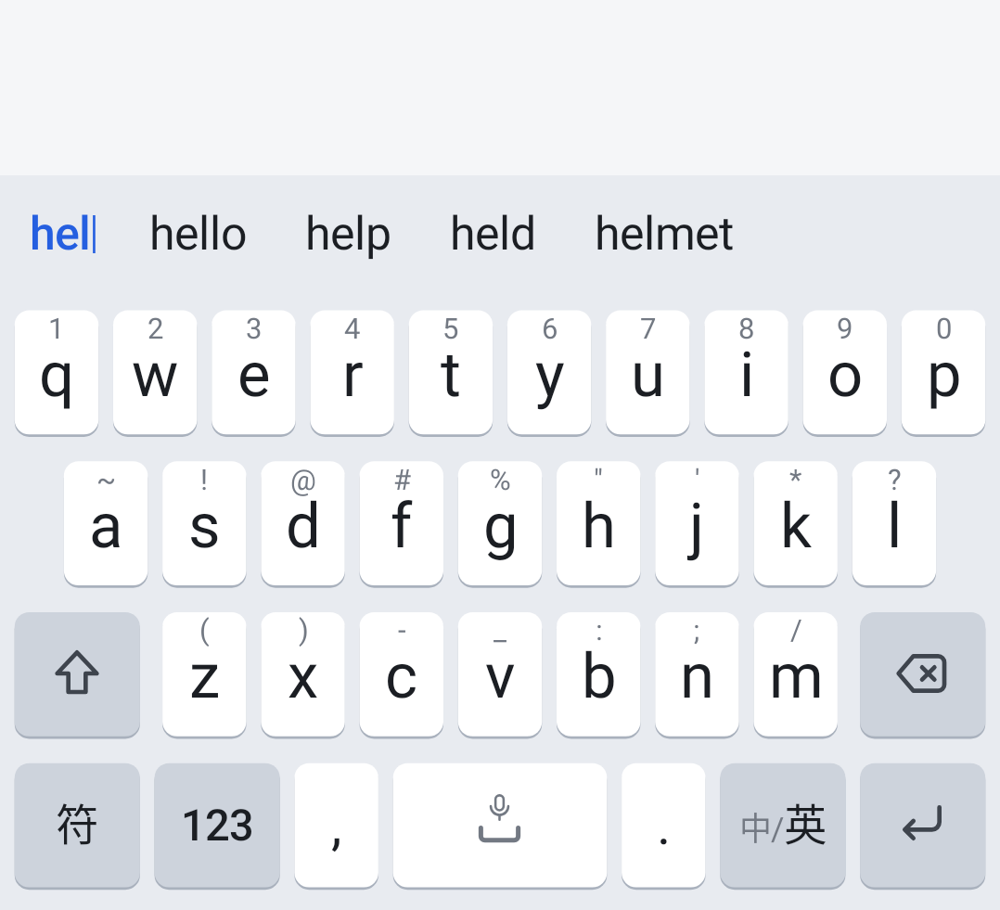
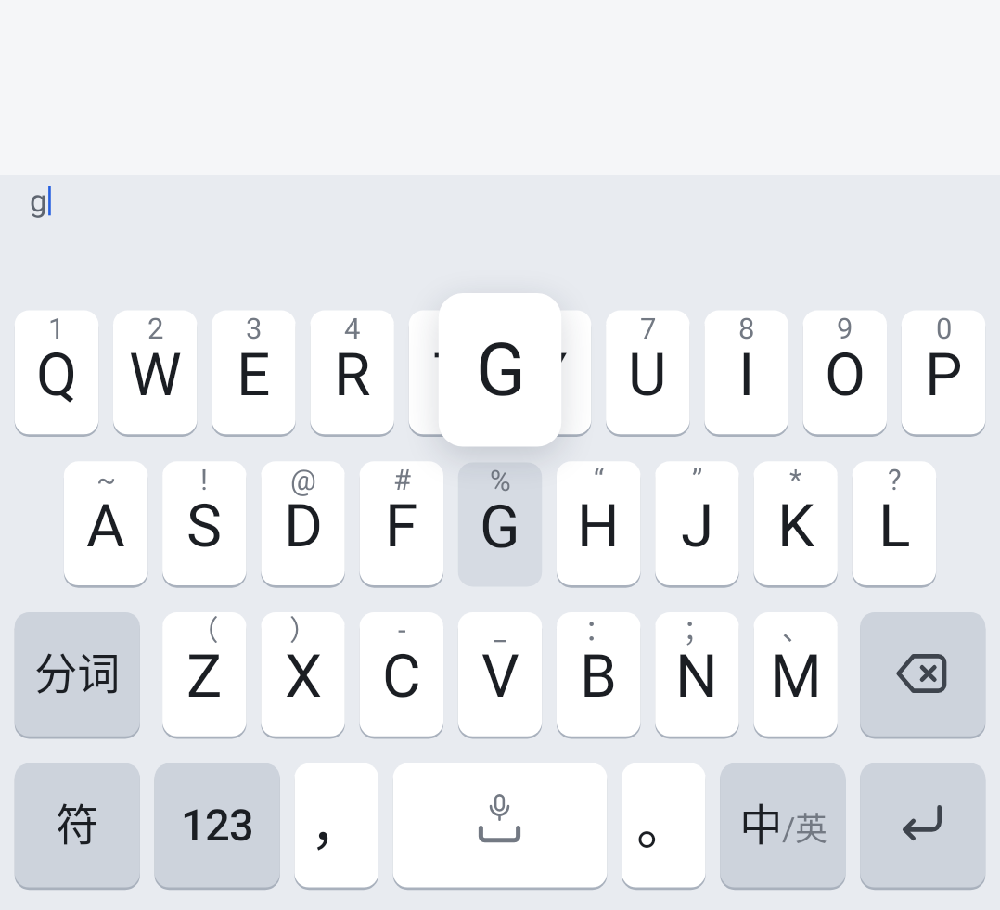
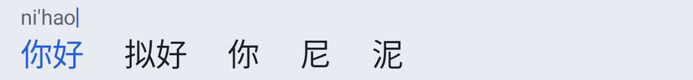

# 06 · 手感、悬浮键盘与多引擎语音 / Feel, Floating Keyboard & Multi-engine Voice

> 实现：`ui/keyboard/Feedback.kt`、`KeySoundSynth.kt`、`FloatingGeometry.kt`、`WeaveKeyboard.kt`、`KeyboardView.kt`、`TopBarView.kt`、`ime/InputController.kt`、
> `VoicePanel.kt`、`VoiceSession.kt`、`voice/MultiEngineResults.kt`、`voice/VoiceBackend.kt`、`settings/LookScreen.kt`、`settings/VoiceScreens.kt`
> 截图：`android/app/src/test/snapshots/`（Roborazzi JVM 截图，运行单元测试即重新生成）
> Screenshots are Roborazzi JVM snapshots, regenerated by the unit tests.

本篇补充 01 §9（手感）、02 §11–12（工具箱、语音面板）与 03 §6–7（语音引擎、外观与手感），描述本轮新增与调整的行为；
与旧文不一致处以本篇为准。
This document extends 01 §9, 02 §11–12 and 03 §6–7; where they differ, this one wins.

---

## 1. 原则 / Principles

- **设置保持精简**：不新增设置页，全部并入现有的「外观与手感」与「语音引擎」；每项都有明确理由。
  *No new pages; everything lives in the existing Look & feel and Voice engine pages.*
- **默认安静**：按键音、按键震动默认都关闭，用户想要时一步打开。
  *Quiet by default: key sound and vibration are both off.*
- **不压缩 App**：悬浮键盘浮在 App 之上，App 保持全高。
  *The floating keyboard never resizes the app.*
- **一次录音，多家识别**：多引擎共用一次录音，由用户挑结果；结果一致时不打扰。
  *One recording, several recognizers; the user picks, unless they all agree.*

## 2. 默认值 / Defaults

| 设置 Setting | 旧默认 Old | 新默认 New | 理由 Reason |
|---|---|---|---|
| 键盘高度 `height_level` | 2「标准」 | **3「较高」** | 用户反馈长屏手机上偏矮 *Too short on tall phones* |
| 按键震动 `vibration` | 1「跟随系统」 | **0「关」** | 用户反馈默认震动打扰 *Default vibration felt intrusive* |
| 按键音 `sound_style` | 关 | 关 | 不变 *Unchanged* |

- **只改默认值，不做迁移**：键不存在时读默认值，所以从没改过的用户自动得到新默认；明确选过的保持原样。
  *Only defaults change: absent keys read the new default; explicit choices are kept.*
- **高度档位**：行距 = 屏高 dp × 0.0615（夹在 46–62）× 档位系数 `0.88 / 0.94 / 1.00 / 1.06 / 1.12`，取整后夹在 40–68 dp。
  在 1080×2400（411×914 dp）上：

  | 档 Level | 名称 | 行距 Row pitch | 键盘高（不含导航栏）Keyboard |
  |---|---|---|---|
  | 2 | 适中（原「标准」） | 56 dp | 278 dp |
  | **3** | **较高（默认）** | **60 dp** | **294 dp** |
  | 4 | 高 | 63 dp | 306 dp（约屏高 1/3） |

  最高档已约占屏高三分之一，不需要再加更高的档位，因此默认取第二高档，仍给想要更高的用户留一档。
  第 2 档改名「适中」，避免「标准」却不是默认的误解。
  *The tallest level already takes about a third of the screen, so no taller level is added; the default is the
  second-tallest. Level 2 is renamed 适中 so "standard" no longer implies the default.*

## 3. 按键音 / Key sounds

### 3.1 风格 / Styles

| 键 Key | 名称 | 合成方式 Synthesis | 时长 Length |
|---|---|---|---|
| `off` | 关（默认） | — | — |
| `system` | 跟随系统 | 系统按键音 `AudioManager.playSoundEffect` | 系统决定 |
| `crisp` | 清脆 | 高通噪声瞬态 + 3.4 kHz 短正弦 *High-passed noise click + short 3.4 kHz sine* | 32–40 ms |
| `bubble` | 气泡 | 正弦上滑 520→1350 Hz *Rising sine sweep* | 48–60 ms |
| `wood` | 木质 | 木块非谐波模态（1 : 2.57 : 4.21 阻尼正弦）+ 敲击噪声 *Inharmonic damped modes* | 56–70 ms |
| `typewriter` | 打字机 | 金属敲击模态 + 机械噪声 + 8 ms 回弹；回车加一声短铃 *Metal strike, return tick; bell on enter* | 45–78 ms |
| `drop` | 水滴 | 指数上滑正弦，柔和起音 *Exponentially rising sine* | 54–66 ms |

- 每种自有风格有 **字母 / 删除 / 空格 / 回车** 四个变体（音高、时长或回声不同），全部 < 80 ms。
  *Four variants per style, all under 80 ms.*
- **全部原创**：声音由 `KeySoundSynth` 按公式生成（固定种子噪声，结果可复现），仓库里没有任何音频文件。
  *All original: generated from formulas with seeded noise; no audio files in the repo.*
- 末尾 3 ms 淡出防爆音，之后逐样本软限幅（不是整段按峰值归一化）：归一化会把每个变体的峰值都顶到满幅，
  乱打时几十毫秒一个、连着放，听感和削波一样吵；软限幅保留瞬态自己的动态，各变体之间的相对轻重也在。
  *3 ms fade-out, then a per-sample soft limiter instead of whole-file normalization: normalizing pins every
  variant to full scale, which reads as clipping when dozens fire per second; soft limiting keeps the transients'
  dynamics and the relative weight of the four variants.*

### 3.2 播放 / Playback

- 首次选用某风格时在后台线程生成 16 bit 单声道 44.1 kHz WAV，写入 `cacheDir/keysounds/v<版本>-<风格>-<变体>.wav`，
  用 `SoundPool`（`USAGE_ASSISTANCE_SONIFICATION`，4 路）载入；之后直接复用缓存。
  *WAVs are synthesized once into the cache and loaded into SoundPool.*
- 放音在独立的反馈线程执行，按键路径只投递一个任务，不阻塞。*Playback is posted to the feedback thread.*
- **静音 / 振动模式不发声**（`ringerMode != RINGER_MODE_NORMAL`）。*Silent in silent/vibrate ringer modes.*
- 音量滑块 0–100，增益 = 0.6x² + 0.4x（低音量更细腻），默认 50；空格与回车再高 15% / 10%，听着是「按下去了」，
  而不是比字母还轻。*Volume 0–100 with a gentle curve; space and enter play 15% / 10% above the letters.*
- 兼容旧设置：旧版开过按键音（`sound` 1–4）而没选过风格的用户显示「跟随系统」，音量换算为 15 / 30 / 50 / 80。
  *Legacy sound levels map to "system" with the matching volume.*

## 4. 设置：外观与手感 › 按键手感 / Settings: Look & feel › Key feel

原来的「振动」「按键音」两个滑块合并为一个「按键手感」分组，只有两行：
*The old vibration and key-sound sliders become one group with two rows:*

```
│ 按键手感                                   │
│ ┌──────────────────────────────────────┐ │
│ │ 按键音                        木质 · 60% │ │ 右侧显示当前值
│ │ [关] [跟随系统] [清脆] [气泡]            │ │ FilterChip，点一下即试听
│ │ [木质] [打字机] [水滴]                   │ │
│ │ 音量  ━━━━━━━━━━━●──────                 │ │ 选了风格才出现；松手试听
│ │ 静音或振动模式下不发声                     │ │
│ ├──────────────────────────────────────┤ │
│ │ 按键震动                                 │ │
│ │ [ 关 │ 轻 │ 中 │ 强 ]                     │ │ SegmentedButton，选中即振动一次
│ └──────────────────────────────────────┘ │
```

- 震动档位轻 / 中 / 强见 01 §9.2。旧版的「跟随系统」（值 1）不再提供但仍然生效，界面在标题右侧显示「跟随系统」、不选中任何分段。
  *Light/medium/strong as in 01 §9.2. Legacy value 1 still works and is labelled on the right.*
- 键盘高度滑块刻度改为「紧凑 · 适中 · 较高 · 高」。*Height ticks: compact · medium · taller · tall.*
- **点一下立刻看得见**：这一页的各块（按键音、按键震动、键盘预览）各自持有「活」的设置
  （`rememberLivePrefs`），选中的风格、音量与档位当场重画；此前预览与卡片在 LookScreen 作用域里
  一次性读到设置，改完要退出这一页再进来才更新。凡是自己读设置的可组合函数都要自己拿，见 `LivePrefs` 的注释。
  *A tap shows at once: each block owns its live preferences, so the picked style, volume and level redraw on the
  spot. Previously the preview and the card read the settings once in the LookScreen scope and only updated after
  leaving and re-entering the page; see the note on `LivePrefs`.*


## 5. 悬浮键盘 / Floating keyboard

### 5.1 入口 / Entry

- 工具箱第 12 格改为 **「悬浮键盘」**（`ic_float`，开关类，开启时染强调色）。原「帮助」一格移出：帮助仍在设置「关于 → 使用帮助」，
  使用频率远低于悬浮键盘，且工具箱保持 4×3 不滚动。
  *Toolbox cell 12 becomes the floating toggle; help stays in Settings › About.*
- 不新增设置项；开关状态存于 `floating`（键盘内开关，与单手模式同类）。*No new setting page.*

### 5.2 形态 / Layout

```
┌──────────────── 屏幕 / screen ─────────────────┐
│                                                 │  App 保持全高，不被压缩
│             (App 内容 / app content)             │  App keeps full height
│                                                 │
│        ┌──────────── ━━━ ─────── ⧉ ┐            │  拖动条 22dp：中间横条，右侧 ⧉ = 停靠
│        │ ◎  ⌨  🎙  ‹I›  📋  ⌄       │            │  顶栏 / 候选栏照常工作
│        │ Q W E R T Y U I O P        │            │  卡片宽 75%（横屏 50%，≤ 480dp）
│        │  A S D F G H J K L         │            │  圆角 16dp，投影 8dp
│        │ ⇧ Z X C V B N M ⌫          │            │  键高用「紧凑」档，比例协调
│        │ 符 123 ,  ␣  。 中 ⏎        │            │
│        └────────────────────────────┘            │
└─────────────────────────────────────────────────┘
```

- **窗口**：输入法窗口保持全宽全高、背景透明；键盘画成卡片。`onComputeInsets` 中
  `contentTopInsets = visibleTopInsets = 窗口底部`，`touchableInsets = TOUCHABLE_INSETS_REGION` 且可触摸区域只有卡片，
  因此 App 不会被压缩，卡片以外的触摸直接落到 App。
  *The IME window stays full size and transparent; insets put content/visible top at the window bottom and only the
  card is touchable, so the app keeps its full height and receives touches outside the card.*
- **移动**：拖动顶部横条移动卡片；卡片始终夹在屏幕内（上留 24dp，下避开导航栏再留 8dp）。
  *Drag the handle; the card is clamped on screen.*
- **记忆位置**：位置以「可移动范围内的比例」保存，横竖屏各一份（`float_pos_port` / `float_pos_land`），换屏幕尺寸也不会跑出屏幕；
  默认水平居中、贴近底部。*Position stored as fractions per orientation; default centred at the bottom.*
- **停靠**：双击横条，或点横条右侧 ⧉，或再点工具箱「悬浮键盘」，回到常规底部键盘。
  *Double-tap the handle, tap ⧉, or toggle again to dock.*
- **卡片内一切照常**：候选栏、展开候选、工具箱、符号、剪贴板、语音面板与引擎弹层都在卡片内；按键气泡、组合串浮层与按住说话语音条跟随卡片。
  悬浮时单手模式不生效（卡片本身已足够小）。*All panels work inside the card; bubbles follow it; one-hand mode is
  ignored while floating.*
- 导航栏在悬浮时透明。*The navigation bar is transparent while floating.*


### 5.3 缩放 / Resize

- 缩放手柄在顶部拖动条的**左端**（44dp 宽、与拖动条等高，画两层直角标记），与右端的停靠按钮对称；它**不占任何按键的触控区**
  （此前放在右下角，会压住回车键的一角）。向左上拖放大、向右下拖缩小，卡片**整体缩放**，按键保持比例：缩放系数取宽、高相对变化的平均值。
  *The grip sits at the left end of the top drag bar (44dp wide, bar height), mirroring the dock button on the
  right, so no key loses touch area (the old bottom-right grip covered a corner of Enter). Drag up/left to grow,
  down/right to shrink; the whole card scales by the average of the relative width and height change.*
- 范围 0.7–1.3，并且：宽不小于 220dp、不超过窗口宽的 95%，高不超过窗口高的 65%（横屏窗口矮时高度上限先起作用）。
  *Scale 0.7–1.3, at least 220dp wide, at most 95% of the window width and 65% of its height.*
- 缩放只改悬浮卡片的行距（可低于常规档的 40dp 下限，最低 32dp），不影响停靠后的键盘高度。
  *Only the floating card's row pitch changes (down to 32dp); the docked height is unaffected.*
- 横竖屏各记一份（`float_size_port` / `float_size_land`）；缩放中卡片**右下角**不动（再夹回屏幕内），松手后记下新位置。
  *Remembered per orientation; the bottom-right corner stays put while resizing (then clamped on screen).*
- `FloatingGeometryTest` 检查手柄与停靠按钮都在拖动条内、与键区不相交，中间留出拖动区。
  *`FloatingGeometryTest` checks that the grip and dock button stay in the bar, clear of the key area.*


## 6. 多引擎语音 / Multi-engine voice

### 6.1 设置：语音引擎 › 同时使用 / Settings: Voice engines › Use together

- 列表里的单选仍是 **主引擎**：说话时实时显示它的文字，结果列表默认高亮它。
  *The radio still picks the primary engine.*
- 已安装 ≥ 2 个引擎时，列表下方出现 **「同时使用」** 分组：其余引擎各一行复选框。
  *With two or more engines, a "use together" group lists the others with checkboxes.*
- **系统语音识别独占麦克风，不能与其它引擎共用录音**：它的行不可勾选并注明「独占麦克风，只能单独使用」；
  主引擎是它时整组不可用并给出说明。*The platform recognizer owns the mic: its row is disabled; if it is the primary,
  the whole group is disabled.*
- 说明文字会写明「每次说话会同时连接 N 个插件的服务」，让流量与配额消耗透明。
  *The note states how many plugin services each utterance contacts.*
- 键盘上的引擎 chip 显示「主引擎名 +N」。*The keyboard chip shows "primary +N".*


### 6.2 录音与扇出 / Recording & fan-out

- 本地离线识别与插件都由织文自己的 `AudioRecord`（16 kHz、16 bit、单声道，每 40 ms 一块）采集；一次录音的每块 PCM 依次交给每个选中的引擎。
  *One AudioRecord capture; every 40 ms chunk goes to every selected engine.*
- 单个引擎出错、起不来或提前结束，只影响它自己那一行，其余引擎继续。*One engine failing never stops the others.*
- 取消 / 超时会取消仍在运行的插件会话；迟到的回调按会话代数丢弃。*Cancel/timeout cancel remaining sessions.*

### 6.3 界面流程 / Flow

1. **说话中**：面板只显示主引擎的文字（灰色中间结果），**不写入输入框**，避免多家结果来回闪。
   *While speaking only the primary's text shows in the panel; nothing goes into the editor.*
2. **停止**（点麦克风 / 静音 2.5 s / 松开按住说话）：面板切换为 **结果列表**，每个引擎一行：

   ```
   │ ⌄        [本 本地离线识别 +2 ⌄]        ⚙ │
   │ ┌──────────────────────────────────────┐ │ 默认行：accentSoft 底 + 强调色描边
   │ │ ★ 本地离线识别                  0.4 秒 │ │ ★ = 主引擎；右侧：耗时
   │ │ 今天下午三点在会议室开会，记得带上电脑   │ │
   │ └──────────────────────────────────────┘ │
   │ ┌──────────────────────────────────────┐ │
   │ │ 示例云端识别                     1.4 秒 │ │
   │ │ 今天下午3点在会议室开会，记得带上电脑。  │ │
   │ └──────────────────────────────────────┘ │
   │ ┌──────────────────────────────────────┐ │
   │ │ 示例插件 B                   识别中… │ │ 识别中 / 出错原因 / 超时（danger 色）
   │ │ …                                     │ │
   │ └──────────────────────────────────────┘ │
   │ [ 取消 ]            (🎙)          [ 上屏 ] │ 🎙 = 重说（丢弃本次结果）
   ```

   - 行高 50dp、间距 6dp，超出时可上下滑动；文字单行，过长时保留结尾。*50 dp rows, scrollable.*
   - **点任意有结果的行即上屏该行**；「上屏」提交默认行；「取消」丢弃；🎙 重新录音。
     *Tap a row to commit it; 上屏 commits the default row; 取消 discards; 🎙 records again.*
3. **默认行** = 主引擎；主引擎失败或超时且没有文字时，回退到第一个成功的引擎。
   *Default row: the primary, else the first success.*
4. **超时**：每个引擎在停止收音后最多等 8 秒，仍未结束的行标为「超时」（已有部分文字仍可选），并取消其会话。
   不需要等最慢的那家：任何已完成的行随时可以点。
   *8 s per engine after the recording stops; timed-out rows keep any partial text; finished rows can be tapped any time.*
5. **结果一致直接上屏**：所有引擎都完成且文字相同（忽略首尾空白）时不显示列表，直接上屏。
   *Identical results commit directly without the list.*
6. **收起键盘 / 关闭面板**：还在说话时，停止收音并在结果出来后自动上屏默认行（与单引擎「收起时保留已识别内容」一致）；
   结果列表已显示时关闭则丢弃（用户看过却没选）。*Hiding while speaking auto-commits the default row later;
   closing a visible list discards it.*
7. **按住说话**（空格长按 / 顶栏话筒长按）与面板共用同一个会话；多引擎时松手后自动打开语音面板显示结果列表。
   *Hold-to-talk shares the session and opens the voice panel for the list.*


### 6.4 本轮未做 / Not in this round

- 倒计时自动上屏：会在用户没选的情况下写入文字，与「点选上屏」冲突，暂不做。
  *Countdown auto-commit: would commit text the user never picked.*
- 结果差异高亮、蜂窝网络下自动跳过插件：留待后续。*Diff highlighting and skipping plugins on cellular: later.*

## 7. 设置项变化 / Settings changes

| 键 Key | 类型 Type | 默认 Default | 位置 Where |
|---|---|---|---|
| `height_level` | int 0–4 | **3** | 外观与手感 › 键盘高度；工具箱 › 键盘调节 |
| `vibration` | int 0 / 2 / 3 / 4（1 = 旧「跟随系统」） | **0** | 外观与手感 › 按键手感 |
| `sound_style` | `off` / `system` / `crisp` / `bubble` / `wood` / `typewriter` / `drop` | `off` | 外观与手感 › 按键手感 |
| `sound_volume` | int 0–100 | 50 | 同上 |
| `floating` | bool | false | 工具箱 › 悬浮键盘 |
| `float_pos_port` / `float_pos_land` | "fx,fy"（0–1） | 居中贴底 | 拖动时写入 |
| `float_size_port` / `float_size_land` | 缩放 0.7–1.3 | 1 | 拖动缩放手柄时写入 |
| `split_wide` | bool | true | 外观与手感 › 宽屏分体键盘（见 02 §15） |
| `weave_voice: also` | 字符串集合 string set | 空 | 语音引擎 › 同时使用 |

## 8. 打字手感 / Typing feel

目标：快速双手打字不丢键、不乱序、不错字；手指按下的同一帧就看到反馈。
*Goal: fast two-thumb typing never drops, reorders or substitutes keys, and feedback shows in the frame of the press.*

### 8.1 多指 / Multi-touch

- 每根手指按 pointer id 各自跟踪（最多 4 根，状态槽预先分配）。输出顺序 = 按下顺序。
  *Every finger is tracked by pointer id (up to four, preallocated slots); output order equals press order.*
- 另一根手指正在长按浮层、空格移动光标、删除左滑清空、左侧列表滚动或按住说话时，新手指的按键**照常输出**，不再被吞。
  *A new finger always types, whatever gesture another finger is in.*
- 新手指按下前先「结算」其它手指：还没输出的功能键（空格、Shift 等）立即按一次点击输出，保证顺序；已输出的字符键不再触发上滑或长按；
  打开的长按浮层收起（保留原字母）。
  *Before a new finger lands, pending function keys fire (order kept), emitted keys lose their swipe/long-press, and
  an open popup closes keeping the letter.*
- `ACTION_CANCEL`（系统接管手势、切面板）不再吞掉已按下的字符键：字符在按下时就已输出。
  *A cancel no longer loses a pressed char key: it was emitted on press.*

### 8.2 按下即输出 / Emit on press

**决定：字符键（字母、标点、数字、九键/14 键的键）在按下时输出；功能键仍在抬起时生效。**
*Decision: char keys emit on DOWN; function keys still act on release.*

- 理由：抬手才输出时，感知延迟 = 按住时长（通常 60–150 ms）+ 解码；按下即输出只剩一帧。这是「粘手」最直接的来源。
  *Commit-on-release adds the hold time (typically 60–150 ms) to every key; emitting on press leaves one frame.*
- 上滑和长按改写：选中上滑字符或浮层里的某一项时，**替换**按下时输出的那个字（`InputController.undoLastInput`：
  组合中内核退一格，已上屏的删掉），再输出新字符。结果与原来抬手才输出完全一致（组合中上滑：先上屏首选，再输出符号）。
  其间若有其它改动（另一根手指、候选点选），不做替换。
  *Swipe-up and long-press replace the char emitted on press (engine backspace while composing, or delete the
  committed text); the result equals the old commit-on-release behaviour. No replacement if anything changed since.*
- 功能键保持抬起生效：空格要区分点击与横滑移动光标、删除要区分点击与长按连删/左滑清空、Shift 要区分单击与双击锁定。
  *Function keys stay on release because their gestures need it.*
- 验证：`TypingFeelTest` 覆盖上滑替换、长按替换、原地松手保留字母、组合中上滑，与原行为逐一对照。
  *Verified by `TypingFeelTest` against the previous results.*

### 8.3 空格与长按 / Space and long press

- 空格横滑超过 8dp 进入光标模式；**若松手时光标一步都没移动，按一次空格处理**（此前这种轻微横滑会吞掉空格）。
  *A space-bar slide that never moved the cursor types a space on release.*
- 中文组合中空格不进入光标模式：横滑照常按空格上屏首选，不会出现「空格没反应」。
  *While composing, the space bar does not enter cursor mode, so it never looks dead.*
- 上滑输出副字符要**明显朝上且够长**：纵向位移 ≥ max(28dp, 0.55 × 键高)，并且 |dy| > 1.5 |dx|（此前是 max(20dp, 0.45 × 键高)、
  |dy| > |dx|）。快速连打时手指的斜向拖动不会再把字母变成数字。
  *Swipe-up needs a clearly vertical, longer movement: at least max(28dp, 0.55 × key height) with |dy| > 1.5 |dx|
  (was max(20dp, 0.45 × key height), |dy| > |dx|), so fast typing no longer turns letters into digits.*
- 长按阈值 **450 ms**（空格 **500 ms**，进入按住说话），从按下事件的时间戳起算，主线程忙时判定也稳定。
  *Long press at 450 ms (space 500 ms), measured from the DOWN event time.*
- 长按浮层对齐上滑字符但**不预选**：不移动就松手，输出的是这个键本身；移到某一项上才选中。
  *The popup preselects nothing: lifting in place keeps the key itself.*
- 光标滑动的速度按事件时间计算，卡顿时不再忽快忽慢。*Cursor drag speed uses event time.*

### 8.4 渲染合并 / Frame-coalesced rendering

- 状态立即生效（按键逻辑总读到最新值）；候选栏、组合串与键面在 Choreographer 帧回调里渲染，**每帧最多一次**。
  触摸分发里只剩按下态、反馈和一次内核调用。
  *State applies at once; the candidate bar, preedit and key labels render in a Choreographer frame callback, at most
  once per frame. Touch dispatch only does press state, feedback and one engine call.*
- 候选栏只测量可见范围再多一屏，滚动时补测；缓冲区复用，不再每键新建数组和 `TextPaint`。
  *The candidate bar measures only the visible range plus one screen, measuring more on scroll; buffers are reused.*
- 键面标签输入不变时不重绘整个键区；按键音、振动的投递任务预先分配，按键路径零分配。
  *Key labels skip the full redraw when nothing changed; feedback tasks are preallocated.*
- 实测（JVM，假内核）：连续 15 个按键只渲染 1 次（此前 15 次）；60 个长候选只测量前 5 个（此前 60 个）；
  200 次按键 + 200 次退格的护栏测试中渲染次数不超过帧数。
  *Measured (JVM, fake engine): a 15-key burst renders once (was 15); 5 of 60 long candidates are measured (was 60);
  the 200-key guard never renders more than once per frame.*
- 解码仍在主线程：内核每键只构造前 120 个候选、加载线程预热数据块后，桌面实测单键均值约 0.5 ms，暂不需要后台解码线程。
  *Decoding stays on the main thread: with 120 candidates per key and warmed blocks the desktop mean is about 0.5 ms
  per key, so no worker thread yet.*

### 8.5 英文输入 / English typing

- 设计不变：组合串**不写入编辑器**（§1 的兼容性理由同样适用于英文）。英文模式下正在敲的单词本来就是候选首项（原样输入），
  现在首项末尾带与组合串相同的闪烁光标，每按一个字母在下一帧就能看到，不再像「整词才出现」。
  *Still no composing text in the editor. The word being typed is the first candidate (typed as-is) and now carries
  the same blinking caret as the preedit, so each letter shows within a frame.*



### 8.6 编辑器 IPC / Editor IPCs

- 每次 `InputConnection` 调用都是到编辑器 App 的一次同步 IPC。`EditorCache` 在本地镜像选区（来自 `EditorInfo.initialSel*` 与
  `onUpdateSelection`）和光标前一小段文字（读一次，之后由我们自己的上屏、删除同步更新；回报晚到时按预期位置对账，
  对不上就丢弃镜像）。
  *Every `InputConnection` call is a synchronous IPC. `EditorCache` mirrors the selection (from `EditorInfo` and
  `onUpdateSelection`) and a short run of text before the cursor (read once, then updated by our own commits and
  deletes; late echoes are matched against expected positions, anything else drops the mirror).*
- **退格**：已知选区为空时一次 `deleteSurroundingText`，按字形簇删（表情、肤色修饰、组合字符一次删完）；有选区时一次
  `commitText("")`。此前每次是 `getSelectedText` + 两次 `sendKeyEvent`。
  *Backspace: one `deleteSurroundingText` of the last grapheme cluster when the selection is known and empty (one
  `commitText("")` for a selection), instead of `getSelectedText` plus two `sendKeyEvent`s.*
- **自动大写**：从镜像本地计算（`TextUtils.getCapsMode`），编辑器没变时复用上次结果；不再每键 `getCursorCapsMode`。
  双击空格、撤销上滑也先查镜像。*Auto-caps is computed locally or reused while nothing changed; double-space and
  swipe undo read the mirror first.*
- **退回原路径**：不回报选区的编辑器（`initialSelStart = -1` 且没有 `onUpdateSelection`）、`TYPE_NULL` 的终端类输入框、
  编辑器里有 composing 区域（语音）、文本开头，以及方向键、粘贴等我们不建模的改动之后，照旧查询并发删除键，直到下一次回报。
  *Fallback — editors that never report the selection, `TYPE_NULL` terminals, a composing region, the start of the
  text, and any edit we don't model — keeps the old query + DEL key path until the next report.*
- 实测（JVM，计数的假连接，`EditorIpcTest`）：连删每次 **1** 次调用（此前 3 次；镜像为空时的第一次是读取 + 删除共 2 次）；
  无联想输入框里敲 `Hi. Y` 共 6 次调用（1 次读取 + 5 次上屏），`getCursorCapsMode` 为 0 次（此前每键 1 次）；英文组合中字母键 0 次。
  *Measured with a counting fake connection: 1 call per repeated delete (was 3; the first one with an empty mirror
  is 2); typing `Hi. Y` in a no-suggestion field takes 6 calls with zero `getCursorCapsMode` (was one per key);
  letters composing in English take none.*

### 8.7 振动与按键气泡 / Haptics and the key preview

- 振动全部投递到 feedback 线程，效果在选定档位时预先建好。「系统」档在 Android 13+ 用预置点击效果 + 触摸用途
  （`VibrationAttributes.USAGE_TOUCH`，遵从系统的触摸振动开关与强度）；只有更早的系统仍在 UI 线程调用
  `performHapticFeedback`（那里只有它能遵从系统开关）。
  *All haptics run on the feedback thread with prebuilt effects. The "system" level uses a predefined click with
  touch usage on Android 13+ (honouring the system touch-haptics setting); only older releases still call
  `performHapticFeedback` on the UI thread, the only way to honour the switch there.*
- 预览气泡是覆盖层之下的**单独小视图**（只覆盖气泡、相连的按键和阴影，尺寸只增不减、按平移定位，平时不触发布局）：
  每键只重录这一小块，淡出只改视图透明度；此前每键要把整张覆盖层重画 6–12 帧（API 26/27 还是软件层）。
  *The preview bubble is its own small view below the overlay (bubble, joined key and shadow only; grow-only size,
  positioned by translation, so no layout per key). A press re-records just that view and the fade only animates its
  alpha — previously the whole overlay redrew for 6–12 frames per key (in software on API 26/27).*



## 9. 实体键盘 / Physical keyboard

- 接着实体键盘、且系统没有要求同时显示软键盘时（系统的 `onEvaluateInputViewShown` 为假），**软键盘隐藏，只显示候选栏**：
  顶栏移到输入法的候选视图里，组合中出现、结束后收起；拔掉实体键盘后顶栏回到键盘里，恢复软键盘。
  *With a physical keyboard (and no system request to also show the soft one) the keys are hidden and only the
  candidate bar shows: the top bar moves into the IME candidates view, shown while composing; detaching the keyboard
  moves it back and the soft keyboard returns.*
- 经过内核：字母、数字、标点（中文模式转全角）、空格、退格；Shift 为大写（中文模式下大写字母直接上屏，英文模式进入联想）。
  *Letters, digits, punctuation (full-width in Chinese), space and backspace go through the engine; Shift types
  uppercase (committed directly in Chinese, composed in English).*
- 组合中：**1–9 选对应候选**，回车原样上屏字母，Esc 取消，方向键 / Home / End / Tab 先上屏原始字母再交给 App。
  *While composing: 1–9 pick a candidate, Enter commits the raw letters, Esc cancels, and arrows / Home / End / Tab
  commit the raw letters before passing through.*
- **Ctrl+空格**切换中/英。其它 Ctrl/Alt/Meta 组合键是 App 的快捷键：组合中先上屏原始字母，再交给 App。不在组合中时回车、Esc
  也交给 App（换行、提交、返回按它自己的规则）。`TYPE_NULL` 的终端类输入框不经过内核。
  *Ctrl+Space toggles Chinese/English. Other Ctrl/Alt/Meta chords are app shortcuts (raw letters are committed
  first); Enter and Esc outside a composition also go to the app. `TYPE_NULL` terminal fields bypass the engine.*
- 验证：`HardwareKeysTest` 用合成的 `KeyEvent` 覆盖以上每一条（按下被处理时对应的抬起也被吞掉）。
  *`HardwareKeysTest` covers each rule with synthetic `KeyEvent`s (a consumed DOWN also consumes its UP).*


- 2026 备忘（排查「导航栏挡住键盘」用）:
  - `InputMethodService` 的 `SoftInputView`（即 our `view` 的父级）是 FrameLayout，API21+ 默认 `fitSystemWindows=true`，会**消耗 navigationBars**。child 收到的 insets.bottom 通常 = 0，**不能信；visible flag 也可能被清**。
  - 必须**从 `service.window?.window?.decorView?.rootWindowInsets` 拿**（窗口级、未被消耗）；如果拿得到，取 `WindowInsets.Type.navigationBars()` + `WindowInsets.Type.ime()` 的 max，作为底部垫高。
  - 不能依赖 root.onApplyWindowInsetsListener 收到的 insets——它是 child 视角，可能已被消耗；该回调只用做"重新读窗口级 insets"的触发信号。
  - IME 显示期间 window insets 总会分发一次，但若分发顺序早于 attach，`root.requestApplyInsets()` in `onShown` 兜一帧；保险做法：**注册 attach-state + onShown + onApplyWindowInsets 三处都重新算**，且每次 `applyInsets` 都用 `host.window?.decorView?.rootWindowInsets` 为准。
